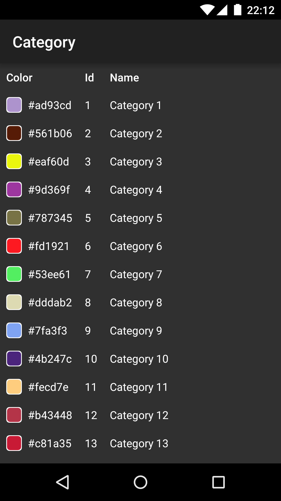
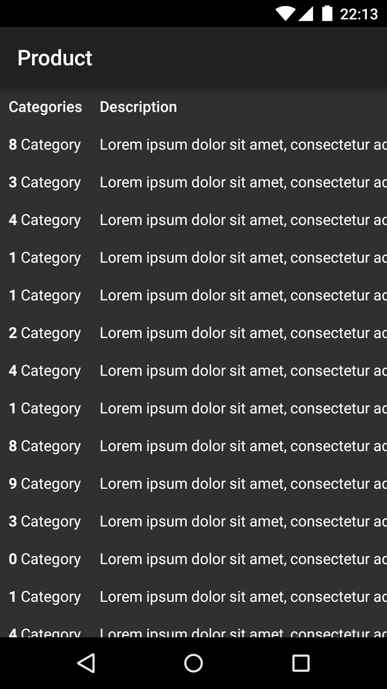

# Kolumbus

Kolumbus allows you to explore your [Realm](https://realm.io/) database from within your Android application.

[](screenshots/Tables.png)
[](screenshots/Table_Category.png)
[](screenshots/Table_Product.png)

## Installation

*Coming soon...*

## Usage

Check the [demo application](app/src/main/kotlin/io/kolumbus/demo/DemoActivity.kt) to see how to use Kolumbus.

The following example assumes that you have two classes named `Category` and `Product` in your project, which both extends from `io.realm.RealmObject`.

```kotlin
// Usage in a Kotlin project
Kolumbus.register(Category::class.java)
    .register(Product::class.java)
    .start(context)
```

```java
// Usage in a Java project
Kolumbus.INSTANCE
    .register(Category.class)
    .register(Product.class)
    .start(context);
```

## TODO

In no particular order:
- Find a better and more efficient way to display a table content than `TableLayout`
- Allow customizing the way the data are displayed
- Sort the content of the displayed table
- Filter the fields that are displayed
- Filter the data that are displayed
- Clear a single table

## License

```
Copyright 2016 MGaetan89

Licensed under the Apache License, Version 2.0 (the "License");
you may not use this file except in compliance with the License.
You may obtain a copy of the License at

   http://www.apache.org/licenses/LICENSE-2.0

Unless required by applicable law or agreed to in writing, software
distributed under the License is distributed on an "AS IS" BASIS,
WITHOUT WARRANTIES OR CONDITIONS OF ANY KIND, either express or implied.
See the License for the specific language governing permissions and
limitations under the License.
```
